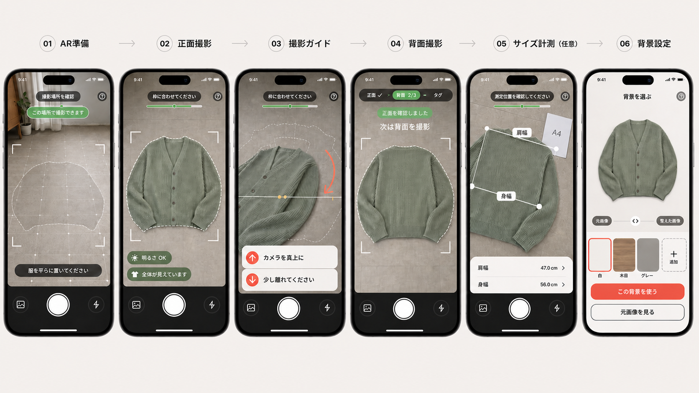

# Mercari AI Agent Hackathon — Team-D

## 概要

**服を売りたいのに、撮影環境や撮影・採寸の知識がなく出品を諦めてしまう人に対して、出品に必要な写真が揃うまで伴走するAI Agentを作る。**

本企画は「Mercari AI Agent Hackathon for PM」に向けたTeam-Dのプロジェクトである。

ユーザーが衣類を撮影するたびにAI Agentが写真の内容と品質を確認し、撮り直し方や次に必要な写真を案内する。必要な写真が揃った後は、実物の商品情報を保ったまま背景を整え、ユーザーの承認を経て出品用画像を完成させる。

このリポジトリは、企画要件・技術設計・OSS調査をまとめたドキュメントの入口である。

## 開発環境

Node.js 20.19以上とnpmを用意し、次のコマンドでWeb画面とNode.js APIを起動する。

```bash
npm install
npm run dev
```

ViteはWeb画面を公開し、`/api`へのリクエストをloopback上のNode.js APIへ転送する。API単体を開発モードで確認する場合は`npm run dev:api`を実行し、`http://127.0.0.1:3001/api/health`へアクセスする。build後のAPIは`npm run start:api`で起動できる。

```bash
npm run typecheck
npm test
npm run build
```

## UIフロー



## ドキュメント一覧

| ファイル | 内容 |
|---|---|
| [requirements.md](./requirements.md) | 企画背景、対象ユーザー、解決策、中心体験、実装範囲をまとめた要件定義 |
| [architecture.md](./architecture.md) | モバイルWeb、画像AI、背景分離、状態管理などの技術構成 |
| [runbook.md](./runbook.md) | LiveKit Cloudの最小接続とデモ運用手順 |
| [garment-measurement-oss.md](./garment-measurement-oss.md) | 衣類の半自動採寸に利用できるOSSと実装方法の調査 |
| [oss-links.md](./oss-links.md) | 採用候補および参考OSSの一覧 |
| [ekyc-ar-ui-flow-final.png](./ekyc-ar-ui-flow-final.png) | AR準備から背景設定までのUIフロー |

## 読む順番

企画全体を理解する場合は、最初に[要件定義](./requirements.md)、次に[Webアーキテクチャ](./architecture.md)を読む。採寸機能を検討する場合は[衣類自動採寸OSS調査](./garment-measurement-oss.md)、利用技術を一覧で確認する場合は[OSS一覧](./oss-links.md)を参照する。
